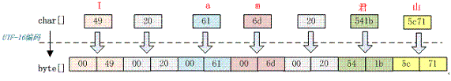
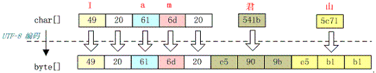
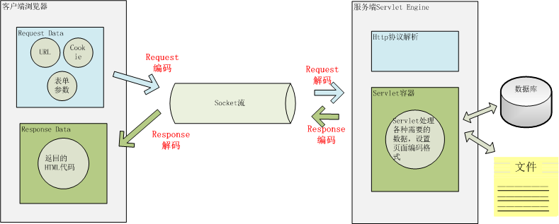
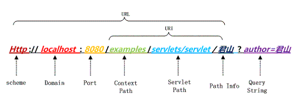
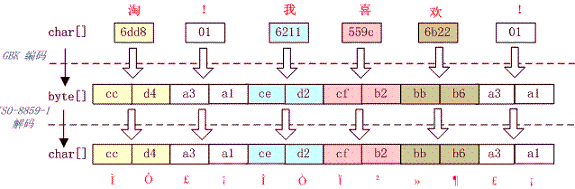
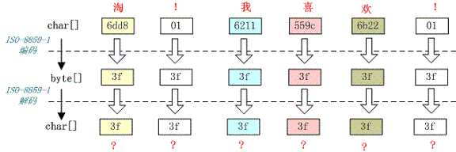
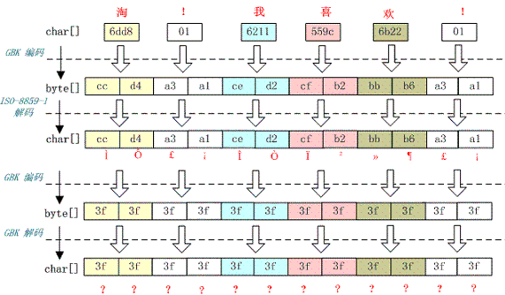
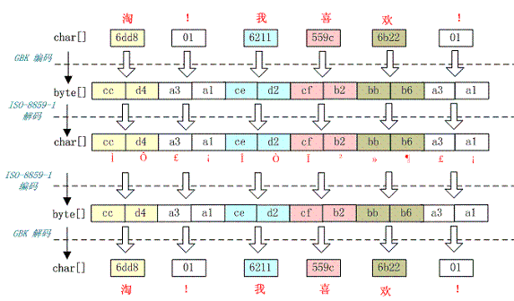

## java 中文编码问题

[TOC]

### 几种常见的编码格式

#### 为什么需要编码
  1. 计算机中存储信息的最小单元是一个字节，8个bit,能够表示的字符是0-255个
  2. 人类要表示的符号太多，无法用一个字节
  3. 要解决这个问题，需要一个新的数据结构，char，从char到byte必须编码

#### 如何翻译
计算中提供了多种编码方式，常见的ASCII、ISO-8859-1、GB2312、GBK、UTF-8、UTF-16  
* ASCII编码  
>ASCII编码总共128个，用一个字节的低7字节表示，0-31控制换行回车删除；32-126是打印字符，能够通过键盘显示出来

* ISO-8859-1
>128个字符显然是不够用的，ISO-8859-1涵盖了大多数西欧语言，仍然是单字节，总共256个字符
* GB2312  
>信息交换用汉字编码字符集 基本集 ,采用双字节编码，总的编码范围是 A1-F7，其中从 A1-A9 是符号区，总共包含 682 个符号，从 B0-F7 是汉字区，包含 6763 个汉字。

* GBK
>全称叫《汉字内码扩展规范》，是国家技术监督局为 windows95 所制定的新的汉字内码规范，它的出现是为了扩展 GB2312，加入更多的汉字，它的编码范围是 8140~FEFE（去掉 XX7F）总共有 23940 个码位，它能表示 21003 个汉字，它的编码是和 GB2312 兼容的，也就是说用 GB2312 每个编码区域有不同的字码长度汉字可以用 GBK 来解码，并且不会有乱码

* UTF-16
>说到 UTF 必须要提到 Unicode（Universal Code 统一码），ISO 试图想创建一个全新的超语言字典，世界上所有的语言都可以通过这本字典来相互翻译。可想而知这个字典是多么的复杂，关于 Unicode 的详细规范可以参考相应文档。Unicode 是 Java 和 XML 的基础，下面详细介绍 Unicode 在计算机中的存储形式。   
>UTF-16定义了Unicode字符在计算机中的存取方法。用两个字节表示Unicode转化格式，这个是定长的表示方法，不论什么字符都可以使用两个字节来表示，两个字节就是16-bit,所以叫UTF-16。  
>***java以UTF-16（Unicode）作为内存中的字符存储格式，***
* UTF-8
>UTF-16采用两个字节表示字符，虽然简化了表示，但是却浪费了很多空间，有很大一部分字符用一个字节就够了，现在用两个字节表示，存储空间放大了一倍。UTF-8则采用了一种变长技术，每个编码区域有不同的字码长度，不同类型的字符可以是1-6个字节。  
>UTF-8有以下编码规则:  
>1. 如果一个字节，最高位（第8位）为0，表示这是一个ASCII编码（00-7F）。可见，所有的ASCII编码已经是UTF-8编码了。  
>2. 如果一个字节，以11开头，连续的1的个数表示这个字符的字节数，例如:1110xxxx表示他是三个字节的UTF-8的首字节。  
>3. 如果一个字节，以10开头，表示这个字节不是首字节，需要向前查找才能找到当前字符的首字节。

### java中需要编码的场景
#### IO操作中存在的编码
我们知道涉及到编码的地方一般都在字符到字节或者字节到字符的转换上，而需要这种转换的场景主要是在 I/O 的时候，这个 I/O 包括磁盘 I/O 和网络 I/O，关于网络 I/O 部分在后面将主要以 Web 应用为例介绍。下图是 Java 中处理 I/O 问题的接口：
  
Reader是java中读取字符的父类，InputStream是java中读字节的父类，InputStreamReader是关联字节到字符桥梁，主要负责I/O过程中读取字节到字符的转换，具体的字节到字符的转换是由SteamDecoder完成的。在StreamDecoder解码过程中用户需要指定charset编码格式，如果没有指定，采用默认的编码格式，中文环境采用GBK编码  
<br/>
写的情况类似，OutputSteam是写字节的父类，Writer是写字符的父类，通过OutputSteamWriter进行字节到字符的转换。  
  
StreamEncoder负责具体字符到字节的编码，编码格式同解码格式是一致的。  

```java
String file = "c:/stream.txt";
String charset = "UTF-8";
// 写字符换转成字节流
FileOutputStream outputStream = new FileOutputStream(file);
OutputStreamWriter writer = new OutputStreamWriter(
outputStream, charset);
try {
   writer.write("这是要保存的中文字符");
} finally {
   writer.close();
}
// 读取字节转换成字符
FileInputStream inputStream = new FileInputStream(file);
InputStreamReader reader = new InputStreamReader(
inputStream, charset);
StringBuffer buffer = new StringBuffer();
char[] buf = new char[64];
int count = 0;
try {
   while ((count = reader.read(buf)) != -1) {
       buffer.append(buffer, 0, count);
   }
} finally {
   reader.close();
}
```
在应用程序涉及到I/O的操作中，注意解码和编码统一的编码格式，如果不指定，则采用默认的编码格式，是还是强烈的不建议使用操作系统的默认编码，因为这样，你的应用程序的编码格式就和运行环境绑定起来了，在跨环境下很可能出现乱码问题。
#### 内存中涉及到的编码
java中String表示字符串，所以String类提供字符到字节的转换方法，也支持将字节转换为字符的的构造函数。
```java
String s="这是一段中文字符串";
//字符到字节的转换
byte [] b=s.getBytes("UTF-8");
//字节到字符的构造函数
String a=new String(b,"UTF-8");
```

java，Charset 提供 encode 与 decode 分别对应 char[] 到 byte[] 的编码和 byte[] 到 char[] 的解码。如下代码所示：
```java
Charset charset = Charset.forName("UTF-8");
ByteBuffer byteBuffer = charset.encode(string);
CharBuffer charBuffer = charset.decode(byteBuffer);
```

java 中还有一个ByteBuffer类，他提供一种char到byte之间的软转换，它们之间转换不需要编码解码，只是把一个16bit的char格式，拆分成2个bit的byte表示，实际值没有修改，只是数据类型转换。  
***可以看出来，java中的char是16bit的Unicode***  
```java
ByteBuffer heapByteBuffer=ByteBuffer.allocate(1024);
ByteBuffer byteBuffer = heapByteBuffer.putChar(c);
```
### java 编码解码
java 编码中用到的类图  
     
首先根据指定的 charsetName 通过 Charset.forName(charsetName) 设置 Charset 类，然后根据 Charset 创建 CharsetEncoder 对象，再调用 CharsetEncoder.encode 对字符串进行编码，不同的编码类型都会对应到一个类中，实际的编码过程是在这些类中完成的。下面是 String. getBytes(charsetName) 编码过程的时序图  
  

从上图可以看出根据 charsetName 找到 Charset 类，然后根据这个字符集编码生成 CharsetEncoder，这个类是所有字符编码的父类，针对不同的字符编码集在其子类中定义了如何实现编码，有了 CharsetEncoder 对象后就可以调用 encode 方法去实现编码了。这个是 String.getBytes 编码方法，其它的如 StreamEncoder 中也是类似的方式。下面看看不同的字符集是如何将前面的字符串编码成 byte 数组的？  

如字符串“I am 君山”的 char 数组为 49 20 61 6d 20 541b 5c71，下面把它按照不同的编码格式转化成相应的字节。

#### 按照 ISO-8859-1 编码
字符串“I am 君山”用 ISO-8859-1 编码，下面是编码结果：  


从上图看出 7 个 char 字符经过 ISO-8859-1 编码转变成 7 个 byte 数组，ISO-8859-1 是单字节编码，中文“君山”被转化成值是 3f 的 byte。3f 也就是“？”字符，所以经常会出现中文变成“？”很可能就是错误的使用了 ISO-8859-1 这个编码导致的。中文字符经过 ISO-8859-1 编码会丢失信息，通常我们称之为“黑洞”，它会把不认识的字符吸收掉。由于现在大部分基础的 Java 框架或系统默认的字符集编码都是 ISO-8859-1，所以很容易出现乱码问题，后面将会分析不同的乱码形式是怎么出现的。
#### 按照 GB2312 编码
字符串“I am 君山”用 GB2312 编码，下面是编码结果：
  
GB2312 对应的 Charset 是 sun.nio.cs.ext. EUC_CN 而对应的 CharsetDecoder 编码类是 sun.nio.cs.ext. DoubleByte，GB2312 字符集有一个 char 到 byte 的码表，不同的字符编码就是查这个码表找到与每个字符的对应的字节，然后拼装成 byte 数组。查表的规则如下：
`c2b[c2bIndex[char >> 8] + (char & 0xff)]`,
如果查到的码位值大于 oxff 则是双字节，否则是单字节。双字节高 8 位作为第一个字节，低 8 位作为第二个字节，如下代码所示：
```java
if (bb > 0xff) {    // DoubleByte
           if (dl - dp < 2)
               return CoderResult.OVERFLOW;
           da[dp++] = (byte) (bb >> 8);
           da[dp++] = (byte) bb;
} else {                      // SingleByte
           if (dl - dp < 1)
               return CoderResult.OVERFLOW;
           da[dp++] = (byte) bb;
}
```
从上图可以看出前 5 个字符经过编码后仍然是 5 个字节，而汉字被编码成双字节，在第一节中介绍到 GB2312 只支持 6763 个汉字，所以并不是所有汉字都能够用 GB2312 编码。

#### 按照GBK
字符串“I am 君山”用 GBK 编码，下面是编码结果：  

  
你可能已经发现上图与 GB2312 编码的结果是一样的，没错 GBK 与 GB2312 编码结果是一样的，由此可以得出 GBK 编码是兼容 GB2312 编码的，它们的编码算法也是一样的。不同的是它们的码表长度不一样，GBK 包含的汉字字符更多。所以只要是经过 GB2312 编码的汉字都可以用 GBK 进行解码，反过来则不然。
#### 按照UTF-16编码

字符串“I am 君山”用 UTF-16 编码，下面是编码结果：  
  
用UTF-16进行编码，数组扩大了一倍，单字节范围内的字符，在高位补0，变成两个字节，中文字符也变成两个字节。从UTF-16编码规则来看，仅仅是将字符的高位和低位拆分变成两个字节。特点是编码效率非常高，规则十分简单.  
不同处理器对 2 字节处理方式不同，Big-endian（高位字节在前，低位字节在后）或 Little-endian（低位字节在前，高位字节在后）编码，所以在对s一串字符串进行编码是需要指明到底是 Big-endian 还是 Little-endian，所以前面有两个字节用来保存 BYTE_ORDER_MARK 值，UTF-16 是用定长 16 位（2 字节）来表示的 UCS-2 或 Unicode 转换格式，通过代理对来访问 BMP 之外的字符编码。

#### 按照UTF-8编码
字符串“I am 君山”用 UTF-8 编码，下面是编码结果：
  
UTF-16虽然效率较高，但是由于所有的字节都是扩大了一倍的存储空间，无形之间也浪费了存储空间，此外，UTF-16采用顺序编码，不能对单个字符进行校验，如果中间的一个字符值损坏，后面所有的码值都会受到影响。而 UTF-8 这些问题都不存在，**UTF-8 对单字节范围内字符仍然用一个字节表示，对汉字采用三个字节表示**。它的编码规则如下：
```java
private CoderResult encodeArrayLoop(CharBuffer src,
ByteBuffer dst){
           char[] sa = src.array();
           int sp = src.arrayOffset() + src.position();
           int sl = src.arrayOffset() + src.limit();
           byte[] da = dst.array();
           int dp = dst.arrayOffset() + dst.position();
           int dl = dst.arrayOffset() + dst.limit();
           int dlASCII = dp + Math.min(sl - sp, dl - dp);
           // ASCII only loop
           while (dp < dlASCII && sa[sp] < '\u0080')
               da[dp++] = (byte) sa[sp++];
           while (sp < sl) {
               char c = sa[sp];
               if (c < 0x80) {
                   // Have at most seven bits
                   if (dp >= dl)
                       return overflow(src, sp, dst, dp);
                   da[dp++] = (byte)c;
               } else if (c < 0x800) {
                   // 2 bytes, 11 bits
                   if (dl - dp < 2)
                       return overflow(src, sp, dst, dp);
                   da[dp++] = (byte)(0xc0 | (c >> 6));
                   da[dp++] = (byte)(0x80 | (c & 0x3f));
               } else if (Character.isSurrogate(c)) {
                   // Have a surrogate pair
                   if (sgp == null)
                       sgp = new Surrogate.Parser();
                   int uc = sgp.parse(c, sa, sp, sl);
                   if (uc < 0) {
                       updatePositions(src, sp, dst, dp);
                       return sgp.error();
                   }
                   if (dl - dp < 4)
                       return overflow(src, sp, dst, dp);
                   da[dp++] = (byte)(0xf0 | ((uc >> 18)));
                   da[dp++] = (byte)(0x80 | ((uc >> 12) & 0x3f));
                   da[dp++] = (byte)(0x80 | ((uc >>  6) & 0x3f));
                   da[dp++] = (byte)(0x80 | (uc & 0x3f));
                   sp++;  // 2 chars
               } else {
                   // 3 bytes, 16 bits
                   if (dl - dp < 3)
                       return overflow(src, sp, dst, dp);
                   da[dp++] = (byte)(0xe0 | ((c >> 12)));
                   da[dp++] = (byte)(0x80 | ((c >>  6) & 0x3f));
                   da[dp++] = (byte)(0x80 | (c & 0x3f));
               }
               sp++;
           }
           updatePositions(src, sp, dst, dp);
           return CoderResult.UNDERFLOW;
}
```
UTF-8 编码与 GBK 和 GB2312 不同，不用查码表，所以在编码效率上 UTF-8 的效率会更好，所以在存储中文字符时 UTF-8 编码比较理想。


[放一个详解UTF-16和UTF-8的链接](https://cloud.tencent.com/developer/article/1341908)

#### 几种编码格式的比较
对中文字符后面四种编码格式都能处理，GB2312 与 GBK 编码规则类似，但是 GBK 范围更大，它能处理所有汉字字符，所以 GB2312 与 GBK 比较应该选择 GBK。UTF-16 与 UTF-8 都是处理 Unicode 编码，它们的编码规则不太相同，相对来说 UTF-16 编码效率最高，字符到字节相互转换更简单，进行字符串操作也更好。它适合在本地磁盘和内存之间使用，可以进行字符和字节之间快速切换，如 Java 的内存编码就是采用 UTF-16 编码。但是它不适合在网络之间传输，因为网络传输容易损坏字节流，一旦字节流损坏将很难恢复，想比较而言 UTF-8 更适合网络传输，对 ASCII 字符采用单字节存储，另外单个字符损坏也不会影响后面其它字符，在编码效率上介于 GBK 和 UTF-16 之间，所以 UTF-8 在编码效率上和编码安全性上做了平衡，是理想的中文编码方式。

### java web 涉及到的编码
对于使用中文来说，有I/O地方就涉及到编码，前面已经提到了I/O操作会引起编码，而大部分I/O引起乱码的都是网络I/O,几乎所有的应用程序都涉及到网络操作，数据经过网络传输都是以字节为单位，所有的数据都需要能够被序列化为字节，在java中数据被序列化必须集成Serializable接口。

#### 压缩
有一个问题，就是尽量压缩cookie大小，减少网络传输量，有不同的压缩算法，但是发现压缩之后字符数是变少了，但是并没有减少字节数。所谓的压缩只是将多个单字节字符通过编码转变成一个多字节字符。减少的是String.length(),并没有减少最终的字节数。比如，“ab”两个字符通过某种编码转变成一个奇怪的字符，虽然字符从两个变成了一个，但是如果采用UTF-8编码这个奇怪的字符，最终的编码可能会变成三个或者更多的字节。同样的道理比如整型数字 1234567 如果当成字符来存储，采用 UTF-8 来编码占用 7 个 byte，采用 UTF-16 编码将会占用 14 个 byte，但是把它当成 int 型数字来存储只需要 4 个 byte 来存储。看一段文本的大小，看字符本身的长度是没有意义的，即使是一样的字符，经过不同的编码，最终存储的大小也会不同，所以从字符到字节，一定要看编码类型。

#### java 汉字表示
***Java 中一个 char 是 16 个 bit 相当于两个字节***

#### java web涉及到的编码
    
如上图所示，用户发起一个http请求，需要存在编码的地方是URL、Cookie和Parameter。服务器接收到HTTP请求之后，需要解析http协议，其中URL、Cookie、parameter需要解码，服务器端可能还有读取数据库中的数据，本地或者网络中其他的文件，这些都存在编码解码的问题，当Servlet 处理完数据之后，需要将返回的数据编码，通过socket发送到用户请求的浏览器里，在经过浏览器解码成为文本。
##### URL编码
用户提交一个URL，URL中可能包含中文，这些中文需要编码，下面讲述编码的规则。  
  
上图是URL的几个组成部分。我们以Tomcat为Server Engine例，Port 对应在 Tomcat 的 <Connector port="8080"/> 中配置，而 Context Path 在 <Context path="/examples"/> 中配置，Servlet Path 在 Web 应用的 web.xml 中的url-pattern中配置  
```
<servlet-mapping>
       <servlet-name>junshanExample</servlet-name>
       <url-pattern>/servlets/servlet/*</url-pattern>
</servlet-mapping>   
```  
<br/>
PathInfo 是我们请求的具体的 Servlet，QueryString 是要传递的参数，注意这里是在浏览器里直接输入 URL 所以是通过 Get 方法请求的，如果是 POST 方法请求的话，QueryString 将通过表单方式提交到服务器端，这个将在后面再介绍。

我们可以看到，上图中的PathInfo 和 QueryString中出现了中文，浏览器对于PathInfo和QueryString的编码是不一样的，Pathinfo是UTF-8，而QueryString则是GBK，当然不同的浏览器可能有不同的编码方式，可以修改。  
下面看一下Tomcat收到这个URL之后是如何解码的。  
解析请求的 URL 是在 org.apache.coyote.HTTP11.InternalInputBuffer 的 parseRequestLine 方法中，这个方法把传过来的 URL 的 byte[] 设置到 org.apache.coyote.Request 的相应的属性中。这里的 URL 仍然是 byte 格式，转成 char 是在 org.apache.catalina.connector.CoyoteAdapter 的 convertURI 方法中完成的：
```java
protected void convertURI(MessageBytes uri, Request request)
throws Exception {
       ByteChunk bc = uri.getByteChunk();
       int length = bc.getLength();
       CharChunk cc = uri.getCharChunk();
       cc.allocate(length, -1);
       String enc = connector.getURIEncoding();
       if (enc != null) {
           B2CConverter conv = request.getURIConverter();
           try {
               if (conv == null) {
                   conv = new B2CConverter(enc);
                   request.setURIConverter(conv);
               }
           } catch (IOException e) {...}
           if (conv != null) {
               try {
                   conv.convert(bc, cc, cc.getBuffer().length -
cc.getEnd());
                   uri.setChars(cc.getBuffer(), cc.getStart(),
cc.getLength());
                   return;
               } catch (IOException e) {...}
           }
       }
       // Default encoding: fast conversion
       byte[] bbuf = bc.getBuffer();
       char[] cbuf = cc.getBuffer();
       int start = bc.getStart();
       for (int i = 0; i < length; i++) {
           cbuf[i] = (char) (bbuf[i + start] & 0xff);
       }
       uri.setChars(cbuf, 0, length);
}
```
从上面的代码中可以知道对 URL 的 URI 部分进行解码的字符集是在 connector 的 <Connector URIEncoding=”UTF-8”/> 中定义的，如果没有定义，那么将以默认编码 ISO-8859-1 解析。所以如果有中文 URL 时最好把 URIEncoding 设置成 UTF-8 编码。  
至于QueryString如何解析，Get请求的QueryString同Post请求的表单参数都是作为Paramters来保存，都是通过request.getParameters来获取参数值，对他们的解码是在request.getParameter第一次被调用的时候执行。request.getParameter 方法被调用时将会调用 org.apache.catalina.connector.Request 的 parseParameters 方法。这个方法将会对 GET 和 POST 方式传递的参数进行解码，但是它们的解码字符集有可能不一样。POST 表单的解码将在后面介绍，QueryString 的解码字符集是在哪定义的呢？  
它本身是HTTP通过Headr传输到服务器的，并且也在URL中，但是同URL的解码字符集是不一样的，我们刚才看到，服务器对于URL，采用connector中的urlencoding设置的方式进行解码,但是，QueryString的解码字符集要么是hear中ContentType定义的CharSet,要么是默认的ISO-8859-1,要想使用ContentType中定义的CharSet进行解码，需要在connector中配置` <Connector URIEncoding=”UTF-8” useBodyEncodingForURI=”true”/>`，将useBodyEncodingForURI定义为true，  
**从上面的 URL 编码和解码过程来看，比较复杂，而且编码和解码并不是我们在应用程序中能完全控制的，所以在我们的应用程序中应该尽量避免在 URL 中使用非 ASCII 字符，不然很可能会碰到乱码问题，当然在我们的服务器端最好设置 <Connector/> 中的 URIEncoding 和 useBodyEncodingForURI 两个参数。**

##### HTTP header 的编码和解码
当我们发送http请求的时候，除了上面的url外，header中还会存在其他的参数，比如cookie、redirectPath等,这些值也可能存在编解码问题，tomcat在处理这些值的时候，是通过request.getHeader()完成的,如果header项没有解码，则调用MessageBytes.toString(),这个方法采用ISO-8859-1编码，将byte编码成char，而我们也不能设置 Header 的其它解码格式，**所以如果你设置 Header 中有非 ASCII 字符解码肯定会有乱码。**
***我们在添加 Header 时也是同样的道理，不要在 Header 中传递非 ASCII 字符，如果一定要传递的话，我们可以先将这些字符用 org.apache.catalina.util.URLEncoder 编码然后再添加到 Header 中，这样在浏览器到服务器的传递过程中就不会丢失信息了，如果我们要访问这些项时再按照相应的字符集解码就好了。***

##### POST表单参数的编码和解码

上面提到post表单参数是同QueryString一样，在第第一调用request.getParameter时候解码，不过post表单参数传递同queryString不同，是通过hppt请求的body进行传递的,当我们在点击submit按钮的时候，浏览器会根据ContetType中的CharSet编码格式将表单填写的参数编码，然后传输给服务器端，tomcat同样采样ContentType的CharSet进行解码。所以通过 POST 表单提交的参数一般不会出现问题，而且这个字符集编码是我们自己设置的，可以通过 **request.setCharacterEncoding(charset)** 来设置。  
另外针对 multipart/form-data 类型的参数，也就是上传的文件编码同样也是使用 ContentType 定义的字符集编码，值得注意的地方是上传文件是用字节流的方式传输到服务器的本地临时目录，这个过程并没有涉及到字符编码，而真正编码是在将文件内容添加到 parameters 中，如果用这个编码不能编码时将会用默认编码 ISO-8859-1 来编码。

##### HTTP BODY的编码和解码
当用户请求的资源获取成功之后，这些内容需要通过responese返回给客户端，这个过程要经过编码然后浏览器解码，可以通过*response.setCharacterEncoding来设置，会覆盖request.getCharacterEncoding中的值，并通过header中的ContentType返回给客户端，浏览器将会根据header中的ContentType进行解码，如果ContentType中没有设置CharSet，浏览器会根据 Html 的 <meta HTTP-equiv="Content-Type" content="text/html; charset=GBK" /> 中的Charset进行解码，如过也没有定义，会使用默认的编码来解码。

### 其他需要编码的地方  
除了 URL 和参数编码问题外，在服务端还有很多地方可能存在编码，如可能需要读取 xml、velocity 模版引擎、JSP 或者从数据库读取数据等。  
xml 文件可以通过设置头来制定编码格式  
```xml
<?xml version="1.0" encoding="UTF-8"?>
```
Velocity 模版设置编码格式：
```java
  services.VelocityService.input.encoding=UTF-8
```
JSP 设置编码格式：
```java
<%@page contentType="text/html; charset=UTF-8"%>
```

访问数据库都是通过客户端 JDBC 驱动来完成，用 JDBC 来存取数据要和数据的内置编码保持一致，可以通过设置 JDBC URL 来制定如 `MySQL：url="jdbc:mysql://localhost:3306/DB?useUnicode=true&characterEncoding=GBK"`。

### 常见问题分析
在了解了 Java Web 中可能需要编码的地方后，下面看一下，当我们碰到一些乱码时，应该怎么处理这些问题？出现乱码问题唯一的原因都是在 char 到 byte 或 byte 到 char 转换中编码和解码的字符集不一致导致的，由于往往一次操作涉及到多次编解码，所以出现乱码时很难查找到底是哪个环节出现了问题，下面就几种常见的现象进行分析。
####  中文变成了看不懂的字符
例如，字符串“淘！我喜欢！”变成了“Ì Ô £ ¡Î Ò Ï²»¶ £ ¡”编码过程如下图所示  
  
字符串在解码时所用的字符集与编码字符集不一致导致汉字变成了看不懂的乱码，而且是一个汉字字符变成两个乱码字符。

#### 一个汉字变成一个问号
例如，字符串“淘！我喜欢！”变成了“？？？？？？”编码过程如下图所示  
  
将中文和中文符号经过不支持中文的 ISO-8859-1 编码后，所有字符变成了“？”，这是因为用 ISO-8859-1 进行编解码时遇到不在码值范围内的字符时统一用 3f 表示，这也就是通常所说的“黑洞”，所有 ISO-8859-1 不认识的字符都变成了“？”。

#### 一个汉字变成两个问号
例如，字符串“淘！我喜欢！”变成了“？？？？？？？？？？？？”编码过程如下图所示  
  
这种情况比较复杂，中文经过多次编码，但是其中有一次编码或者解码不对仍然会出现中文字符变成“？”现象，出现这种情况要仔细查看中间的编码环节，找出出现编码错误的地方。  

#### 一种不正常的编码
还有一种情况是在我们通过 request.getParameter 获取参数值时，当我们直接调用`String value = request.getParameter(name); `会出现乱码，但是如果用`String value =String(request.getParameter(name).getBytes("
ISO-8859-1"), "GBK"); `解析时取得的 value 会是正确的汉字字符，这种情况是怎么造成的呢？
  
这种情况是这样的，ISO-8859-1 字符集的编码范围是 0000-00FF，正好和一个字节的编码范围相对应。这种特性保证了使用 ISO-8859-1 进行编码和解码可以保持编码数值“不变”。虽然中文字符在经过网络传输时，被错误地“拆”成了两个欧洲字符，但由于输出时也是用 ISO-8859-1，结果被“拆”开的中文字的两半又被合并在一起，从而又刚好组成了一个正确的汉字。虽然最终能取得正确的汉字，但是还是不建议用这种不正常的方式取得参数值，因为这中间增加了一次额外的编码与解码，这种情况出现乱码时因为 Tomcat 的配置文件中 useBodyEncodingForURI 配置项没有设置为”true”，从而造成第一次解析式用 ISO-8859-1 来解析才造成乱码的。
