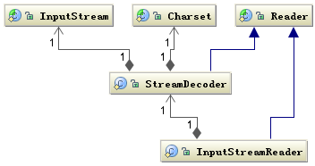
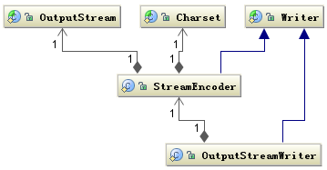
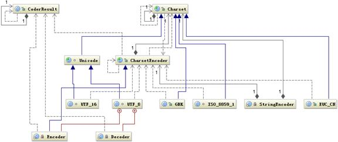
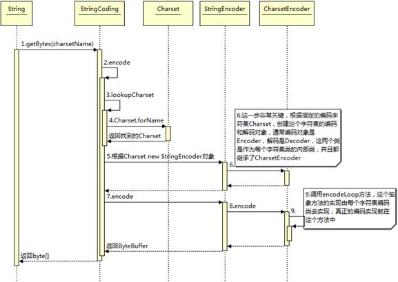
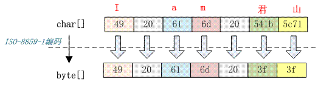
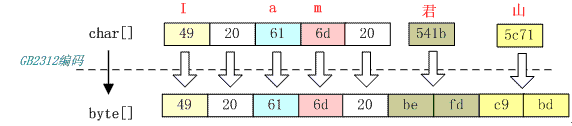
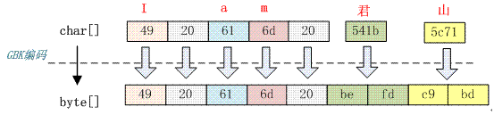

## java 中文编码问题

[TOC]

### 几种常见的编码格式

#### 为什么需要编码
  1. 计算机中存储信息的最小单元是一个字节，8个bit,能够表示的字符是0-255个
  2. 人类要表示的符号太多，无法用一个字节
  3. 要解决这个问题，需要一个新的数据结构，char，从char到byte必须编码

#### 如何翻译
计算中提供了多种编码方式，常见的ASCII、ISO-8859-1、GB2312、GBK、UTF-8、UTF-16  
* ASCII编码  
>ASCII编码总共128个，用一个字节的低7字节表示，0-31控制换行回车删除；32-126是打印字符，能够通过键盘显示出来

* ISO-8859-1
>128个字符显然是不够用的，ISO-8859-1涵盖了大多数西欧语言，仍然是单字节，总共256个字符
* GB2312  
>信息交换用汉字编码字符集 基本集 ,采用双字节编码，总的编码范围是 A1-F7，其中从 A1-A9 是符号区，总共包含 682 个符号，从 B0-F7 是汉字区，包含 6763 个汉字。

* GBK
>全称叫《汉字内码扩展规范》，是国家技术监督局为 windows95 所制定的新的汉字内码规范，它的出现是为了扩展 GB2312，加入更多的汉字，它的编码范围是 8140~FEFE（去掉 XX7F）总共有 23940 个码位，它能表示 21003 个汉字，它的编码是和 GB2312 兼容的，也就是说用 GB2312 每个编码区域有不同的字码长度汉字可以用 GBK 来解码，并且不会有乱码

* UTF-16
>说到 UTF 必须要提到 Unicode（Universal Code 统一码），ISO 试图想创建一个全新的超语言字典，世界上所有的语言都可以通过这本字典来相互翻译。可想而知这个字典是多么的复杂，关于 Unicode 的详细规范可以参考相应文档。Unicode 是 Java 和 XML 的基础，下面详细介绍 Unicode 在计算机中的存储形式。   
>UTF-16定义了Unicode字符在计算机中的存取方法。用两个字节表示Unicode转化格式，这个是定长的表示方法，不论什么字符都可以使用两个字节来表示，两个字节就是16-bit,所以叫UTF-16。  
>***java以UTF-16（Unicode）作为内存中的字符存储格式，***
* UTF-8
>UTF-16采用两个字节表示字符，虽然简化了表示，但是却浪费了很多空间，有很大一部分字符用一个字节就够了，现在用两个字节表示，存储空间放大了一倍。UTF-8则采用了一种变长技术，每个编码区域有不同的字码长度，不同类型的字符可以是1-6个字节。  
>UTF-8有以下编码规则:  
>1. 如果一个字节，最高位（第8位）为0，表示这是一个ASCII编码（00-7F）。可见，所有的ASCII编码已经是UTF-8编码了。  
>2. 如果一个字节，以11开头，连续的1的个数表示这个字符的字节数，例如:1110xxxx表示他是三个字节的UTF-8的首字节。  
>3. 如果一个字节，以10开头，表示这个字节不是首字节，需要向前查找才能找到当前字符的首字节。

### java中需要编码的场景
#### IO操作中存在的编码
我们知道涉及到编码的地方一般都在字符到字节或者字节到字符的转换上，而需要这种转换的场景主要是在 I/O 的时候，这个 I/O 包括磁盘 I/O 和网络 I/O，关于网络 I/O 部分在后面将主要以 Web 应用为例介绍。下图是 Java 中处理 I/O 问题的接口：
  
Reader是java中读取字符的父类，InputStream是java中读字节的父类，InputStreamReader是关联字节到字符桥梁，主要负责I/O过程中读取字节到字符的转换，具体的字节到字符的转换是由SteamDecoder完成的。在StreamDecoder解码过程中用户需要指定charset编码格式，如果没有指定，采用默认的编码格式，中文环境采用GBK编码  
<br/>
写的情况类似，OutputSteam是写字节的父类，Writer是写字符的父类，通过OutputSteamWriter进行字节到字符的转换。  
  
StreamEncoder负责具体字符到字节的编码，编码格式同解码格式是一致的。  

```java
String file = "c:/stream.txt";
String charset = "UTF-8";
// 写字符换转成字节流
FileOutputStream outputStream = new FileOutputStream(file);
OutputStreamWriter writer = new OutputStreamWriter(
outputStream, charset);
try {
   writer.write("这是要保存的中文字符");
} finally {
   writer.close();
}
// 读取字节转换成字符
FileInputStream inputStream = new FileInputStream(file);
InputStreamReader reader = new InputStreamReader(
inputStream, charset);
StringBuffer buffer = new StringBuffer();
char[] buf = new char[64];
int count = 0;
try {
   while ((count = reader.read(buf)) != -1) {
       buffer.append(buffer, 0, count);
   }
} finally {
   reader.close();
}
```
在应用程序涉及到I/O的操作中，注意解码和编码统一的编码格式，如果不指定，则采用默认的编码格式，是还是强烈的不建议使用操作系统的默认编码，因为这样，你的应用程序的编码格式就和运行环境绑定起来了，在跨环境下很可能出现乱码问题。
#### 内存中涉及到的编码
java中String表示字符串，所以String类提供字符到字节的转换方法，也支持将字节转换为字符的的构造函数。
```java
String s="这是一段中文字符串";
//字符到字节的转换
byte [] b=s.getBytes("UTF-8");
//字节到字符的构造函数
String a=new String(b,"UTF-8");
```

java，Charset 提供 encode 与 decode 分别对应 char[] 到 byte[] 的编码和 byte[] 到 char[] 的解码。如下代码所示：
```java
Charset charset = Charset.forName("UTF-8");
ByteBuffer byteBuffer = charset.encode(string);
CharBuffer charBuffer = charset.decode(byteBuffer);
```

java 中还有一个ByteBuffer类，他提供一种char到byte之间的软转换，它们之间转换不需要编码解码，只是把一个16bit的char格式，拆分成2个bit的byte表示，实际值没有修改，只是数据类型转换。  
***可以看出来，java中的char是16bit的Unicode***  
```java
ByteBuffer heapByteBuffer=ByteBuffer.allocate(1024);
ByteBuffer byteBuffer = heapByteBuffer.putChar(c);
```
### java 编码解码
java 编码中用到的类图  
     
首先根据指定的 charsetName 通过 Charset.forName(charsetName) 设置 Charset 类，然后根据 Charset 创建 CharsetEncoder 对象，再调用 CharsetEncoder.encode 对字符串进行编码，不同的编码类型都会对应到一个类中，实际的编码过程是在这些类中完成的。下面是 String. getBytes(charsetName) 编码过程的时序图  
  

从上图可以看出根据 charsetName 找到 Charset 类，然后根据这个字符集编码生成 CharsetEncoder，这个类是所有字符编码的父类，针对不同的字符编码集在其子类中定义了如何实现编码，有了 CharsetEncoder 对象后就可以调用 encode 方法去实现编码了。这个是 String.getBytes 编码方法，其它的如 StreamEncoder 中也是类似的方式。下面看看不同的字符集是如何将前面的字符串编码成 byte 数组的？  

如字符串“I am 君山”的 char 数组为 49 20 61 6d 20 541b 5c71，下面把它按照不同的编码格式转化成相应的字节。

#### 按照 ISO-8859-1 编码
字符串“I am 君山”用 ISO-8859-1 编码，下面是编码结果：  


从上图看出 7 个 char 字符经过 ISO-8859-1 编码转变成 7 个 byte 数组，ISO-8859-1 是单字节编码，中文“君山”被转化成值是 3f 的 byte。3f 也就是“？”字符，所以经常会出现中文变成“？”很可能就是错误的使用了 ISO-8859-1 这个编码导致的。中文字符经过 ISO-8859-1 编码会丢失信息，通常我们称之为“黑洞”，它会把不认识的字符吸收掉。由于现在大部分基础的 Java 框架或系统默认的字符集编码都是 ISO-8859-1，所以很容易出现乱码问题，后面将会分析不同的乱码形式是怎么出现的。
#### 按照 GB2312 编码
字符串“I am 君山”用 GB2312 编码，下面是编码结果：
  
GB2312 对应的 Charset 是 sun.nio.cs.ext. EUC_CN 而对应的 CharsetDecoder 编码类是 sun.nio.cs.ext. DoubleByte，GB2312 字符集有一个 char 到 byte 的码表，不同的字符编码就是查这个码表找到与每个字符的对应的字节，然后拼装成 byte 数组。查表的规则如下：
`c2b[c2bIndex[char >> 8] + (char & 0xff)]`,
如果查到的码位值大于 oxff 则是双字节，否则是单字节。双字节高 8 位作为第一个字节，低 8 位作为第二个字节，如下代码所示：
```java
if (bb > 0xff) {    // DoubleByte
           if (dl - dp < 2)
               return CoderResult.OVERFLOW;
           da[dp++] = (byte) (bb >> 8);
           da[dp++] = (byte) bb;
} else {                      // SingleByte
           if (dl - dp < 1)
               return CoderResult.OVERFLOW;
           da[dp++] = (byte) bb;
}
```
从上图可以看出前 5 个字符经过编码后仍然是 5 个字节，而汉字被编码成双字节，在第一节中介绍到 GB2312 只支持 6763 个汉字，所以并不是所有汉字都能够用 GB2312 编码。

#### 按照GBK
字符串“I am 君山”用 GBK 编码，下面是编码结果：  

  
你可能已经发现上图与 GB2312 编码的结果是一样的，没错 GBK 与 GB2312 编码结果是一样的，由此可以得出 GBK 编码是兼容 GB2312 编码的，它们的编码算法也是一样的。不同的是它们的码表长度不一样，GBK 包含的汉字字符更多。所以只要是经过 GB2312 编码的汉字都可以用 GBK 进行解码，反过来则不然。
#### 按照UTF-16编码

字符串“I am 君山”用 UTF-16 编码，下面是编码结果：
