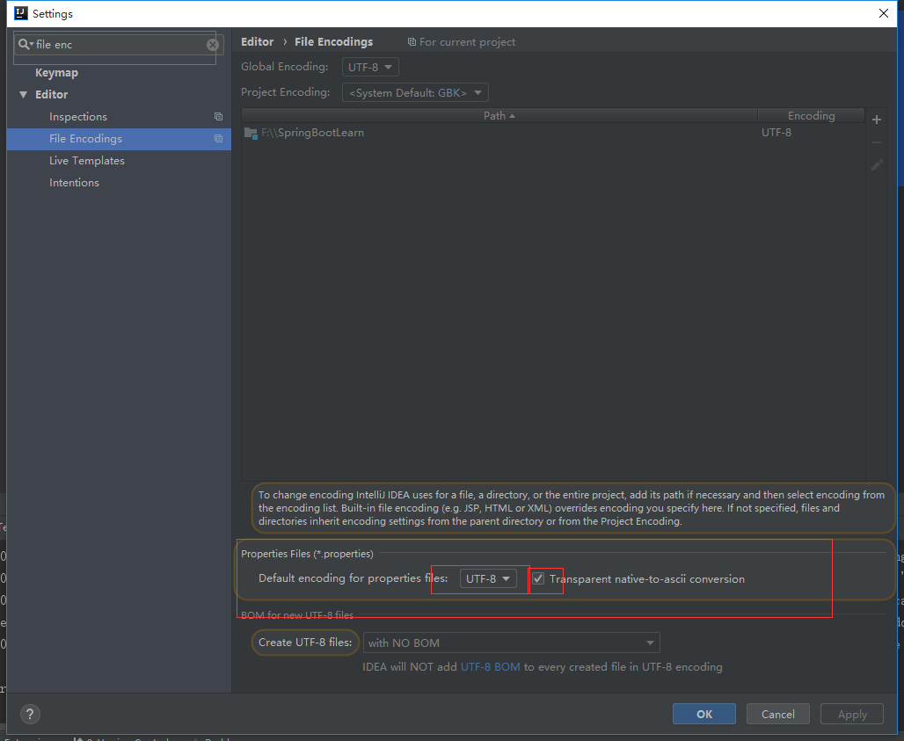

## Spring Boot Learn 学习笔记

[TOC]


### 单元测试
spring boot 取消了 @SpringApplicationConfiguration 这个注解，使用@SpringBootTest 就可以了

### application.properties
#### 使用随机数
```
# 随机字符串
com.didispace.blog.value=${random.value}
# 随机int
com.didispace.blog.number=${random.int}
# 随机long
com.didispace.blog.bignumber=${random.long}
# 10以内的随机数
com.didispace.blog.test1=${random.int(10)}
# 10-20的随机数
com.didispace.blog.test2=${random.int[10,20]}
```
#### 参数相互引用
```
com.didispace.blog.name=程序猿DD
com.didispace.blog.title=Spring Boot教程
com.didispace.blog.desc=${com.didispace.blog.name}正在努力写《${com.didispace.blog.title}》
```
#### 命令行设置属性
在命令行运行时，连续的两个减号--就是对application.properties中的属性值进行赋值的标识。所以，java -jar xxx.jar --server.port=8888命令，等价于我们在application.properties中添加属性server.port=8888，该设置在样例工程中可见，读者可通过删除该值或使用命令行来设置该值来验证。  
通过命令行来修改属性值固然提供了不错的便利性，但是通过命令行就能更改应用运行的参数，那岂不是很不安全？是的，所以Spring Boot也贴心的提供了屏蔽命令行访问属性的设置，只需要这句设置就能屏蔽：SpringApplication.setAddCommandLineProperties(false)。
#### 多环境配置
在Spring Boot中多环境配置文件名需要满足application-{profile}.properties的格式，其中{profile}对应你的环境标识，比如：  
* application-dev.properties：开发环境
* application-test.properties：测试环境
* application-prod.properties：生产环境
  
至于哪个具体的配置文件会被加载，需要在application.properties文件中通过`spring.profiles.active`属性来设置，其值对应{profile}值。  
#### 全小写配置和移除特殊字符
application.properties配置均以全小写的方式匹配，并且移除了特殊字符。下面4种配置
方式是等价的。
```
spring.jpa.databaseplatform=mysql
spring.jpa.database-platform=mysql
spring.jpa.databasePlatform=mysql
spring.JPA.database_platform=mysql
```
#### List类型
properties文件中使用[]定位列表类型，比如：  
```
spring.my-example.url[0]=http://example.com
spring.my-example.url[1]=http://spring.io
```
也可以使用逗号分配的配置方式，上面的配置方式同下面是等价的。  
```
spring.my-example.url=http://example.com,http://spring.io
```
在spring-boot 2.0中，对列表的配置必须是连续的，不然会抛出UnboundConfigurationPropertiesException异常，所以下面的配置是不允许的。  
```
foo[0]=a
foo[2]=b
```

### 将配置文件中的属性值注入到spring 组件中
#### 利用yaml
比如我们现在有一个java bean
```java
@Component
@Getter
@Setter
@ToString

@ConfigurationProperties(prefix = "person")
public class Person {
    private String lastName;
    private int age;
    private Boolean boss;
    private Date birth;

    private Map<String, Object> maps;
    private List<Object> list;
    private Dog dog;
}
```
```java
@Component
@Getter
@Setter
@ToString
public class Dog {
    private String name;
    private int age;
}
```
然后在application.yml中配置了这个类的属性
```yaml
    person:
      lastName: zhangsan
      age: 18
      boss: false
      birth: 2018/01/12
      maps: {k1: v,k2: v}
      list:
        - cat
        - dog
        - pig
      dog:
        name: dog
        age: 2
```
想要将application.yml中的值注入到person中，需要在Person类上使用@ConfigurationPropertis(prefix="person")注解，该注解表示本类中所有属性同配置文件的相关配置进行绑定。prefix指定person前缀下面的所哟有属性进行一一映射。  
>**NODE**  
>导入以下依赖，在yml中写属性就会有提示
```java
      <dependency>
            <groupId>org.springframework.boot</groupId>
            <artifactId>spring-boot-configuration-processor</artifactId>
            <optional>true</optional>
        </dependency>
```
#### 利用properties
 java bean的代码同上，properties如下
 ```properties
    person.last-name='张山'
    person.age=18
    person.birth=2018/01/02
    person.list=a,b,c
    person.boss=false
    person.maps.k1=1
    person.maps.k2=2
    person.dog.name=dog
    person.dog.age=2
 ```

 >**IDEA properties中文乱码**  
 >IDEA properties 默认UTF-8编码，要做如下设置  



#### \@Value 和 \@ConfigurationProperties 区别
| | \@ConfigurationProperties | \@value | 
| -|-|- |
| 功能 | 批量注入配置文件中的属性 | 一个个的指定 |
| 松散绑定（松散语法）| 支持 | 不支持 |
| SpEL | 不支持 | 支持 |
| JSR303数据校验 | 支持 | 不支持 |
| 复杂类型封装（map等） | 支持 | 支持 |


**JSR303** 数据校验

```java
@Component
@Getter
@Setter
@ToString

@ConfigurationProperties(prefix = "person")
@Validated
public class Person {
    @Email
    private String lastName;
    private int age;
    private Boolean boss;
    private Date birth;

    private Map<String, Object> maps;
    private List<Object> list;
    private Dog dog;
}
```
#### \@PropertySource
\@ConfigurationProperties 默认从全局application.properties中加载配置，使用\@PropertySource指定关联的配置文件

#### 配置文件占位符
获取之前配置的值，如果没有，用：指定默认值
```properties
    pser.name=${person.hello:hell0}_dog
```


### yaml 同一个文件中配置多个环境
#### 多properties文件
**参考reference种使用多个properties文件配置多个环境的方式

#### 1个yaml文件
可以在一个yml文件中，区分多个文档快，然后在每个文档快中配置不同环境的参数，在第一个文档块中配置需要激活的环境
```yaml
server:
  port: 8080

spring:
  profiles:
    active: dev
---
server:
     port: 9999
spring:
  profiles: dev

---

server:
  port: 7777
spring:
  profiles: test
```
#### 激活指定profile
1. 在配置文件中指定,比如spring.profiles.active=dev
2. 命令行 java -jar ***.jar --spring.profiles.active=dev
3. 虚拟机参数 -Dspring.profiles.active=dev