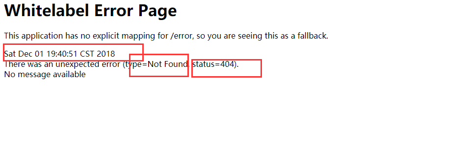
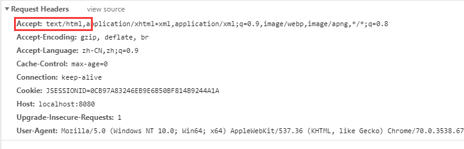
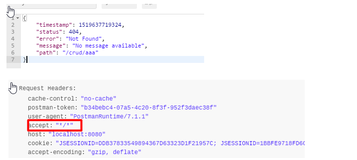

 [TOC]

# 错误处理机制

## 1. spring boot 默认的错误处理机制

默认效果：  


1. 浏览器：返回一个默认的错误界面




 浏览器发送的请求头中带有`text/html`  
  

2. 如果是其他客户端，默认响应一个json数据




原理：  
可以参照 ErrorMvcAutoConfiguration错误处理的自动配置；  

> 给容器注册了以下组件

1. ErrorPageCustomizer  
```java
@Value("${error.path:/error}")
private String path = "/error"; 系统出现错误之后，来到error请求进行处理


 private static class ErrorPageCustomizer implements ErrorPageRegistrar, Ordered {
        private final ServerProperties properties;
        private final DispatcherServletPath dispatcherServletPath;

        protected ErrorPageCustomizer(ServerProperties properties, DispatcherServletPath dispatcherServletPath) {
            this.properties = properties;
            this.dispatcherServletPath = dispatcherServletPath;
        }

        public void registerErrorPages(ErrorPageRegistry errorPageRegistry) {
            ErrorPage errorPage = new ErrorPage(this.dispatcherServletPath.getRelativePath(this.properties.getError().getPath()));
            errorPageRegistry.addErrorPages(new ErrorPage[]{errorPage});
        }

        public int getOrder() {
            return 0;
        }
    }
```

2. BasicErrorController

```java
@Controller
@RequestMapping({"${server.error.path:${error.path:/error}}"})
public class BasicErrorController extends AbstractErrorController {
    private final ErrorProperties errorProperties;

    public BasicErrorController(ErrorAttributes errorAttributes, ErrorProperties errorProperties) {
        this(errorAttributes, errorProperties, Collections.emptyList());
    }

    public BasicErrorController(ErrorAttributes errorAttributes, ErrorProperties errorProperties, List<ErrorViewResolver> errorViewResolvers) {
        super(errorAttributes, errorViewResolvers);
        Assert.notNull(errorProperties, "ErrorProperties must not be null");
        this.errorProperties = errorProperties;
    }

    public String getErrorPath() {
        return this.errorProperties.getPath();
    }

//产生html类型的数据；浏览器发送的请求来到这个方法处理
    @RequestMapping( produces = {"text/html"} )
    public ModelAndView errorHtml(HttpServletRequest request, HttpServletResponse response) {
        HttpStatus status = this.getStatus(request);
        Map<String, Object> model = Collections.unmodifiableMap(this.getErrorAttributes(request, this.isIncludeStackTrace(request, MediaType.TEXT_HTML)));
        response.setStatus(status.value());
        //去哪个页面作为错误页面；包含页面地址和页面内容
        ModelAndView modelAndView = this.resolveErrorView(request, response, status, model);
        return modelAndView != null ? modelAndView : new ModelAndView("error", model);
    }

    //产生json数据，其他客户端来到这个方法处理
    @RequestMapping
    public ResponseEntity<Map<String, Object>> error(HttpServletRequest request) {
        Map<String, Object> body = this.getErrorAttributes(request, this.isIncludeStackTrace(request, MediaType.ALL));
        HttpStatus status = this.getStatus(request);
        return new ResponseEntity(body, status);
    }

    protected boolean isIncludeStackTrace(HttpServletRequest request, MediaType produces) {
        IncludeStacktrace include = this.getErrorProperties().getIncludeStacktrace();
        if (include == IncludeStacktrace.ALWAYS) {
            return true;
        } else {
            return include == IncludeStacktrace.ON_TRACE_PARAM ? this.getTraceParameter(request) : false;
        }
    }

    protected ErrorProperties getErrorProperties() {
        return this.errorProperties;
    }
}
```

3. DefaultErrorViewResolver

```java
 public ModelAndView resolveErrorView(HttpServletRequest request, HttpStatus status, Map<String, Object> model) {
        ModelAndView modelAndView = this.resolve(String.valueOf(status.value()), model);
        if (modelAndView == null && SERIES_VIEWS.containsKey(status.series())) {
            modelAndView = this.resolve((String)SERIES_VIEWS.get(status.series()), model);
        }

        return modelAndView;
    }

    private ModelAndView resolve(String viewName, Map<String, Object> model) {
        //错误页面的地址。viewname默认是错误状态吗
        String errorViewName = "error/" + viewName;
        //模板引擎可以解析这个页面地址，就用个模板引擎解析
        TemplateAvailabilityProvider provider = this.templateAvailabilityProviders.getProvider(errorViewName, this.applicationContext);

        //如果模板引擎可用，就返回errorViewName对应的页面，否则去静态资源文件夹下面找对errorViewName对应的页面。
        return provider != null ? new ModelAndView(errorViewName, model) : this.resolveResource(errorViewName, model);
    }
```

4. DefaultErrorAttributes
```java
public Map<String, Object> getErrorAttributes(WebRequest webRequest, boolean includeStackTrace) {
        Map<String, Object> errorAttributes = new LinkedHashMap();
        errorAttributes.put("timestamp", new Date());
        this.addStatus(errorAttributes, webRequest);
        this.addErrorDetails(errorAttributes, webRequest, includeStackTrace);
        this.addPath(errorAttributes, webRequest);
        return errorAttributes;
    }
```

步骤：  
一旦系统出现4xx 或者5xx之类的错误，ErrorPageCustomizer就会生效，就会来到已经注册的/error请求，由BasicErrorController处理。具体去那个界面，是由DefaultErrorViewResolver解析得到的，默认根据状态码匹配。

## 2、定制错误响应
### 2.1 定制错误的页面

1. 有模板引擎的情况下，error/状态码； 
 
将错误页面命名为错误状态码.html放在模板引擎文件夹里面的error文件夹下】，发生此状态码的错误就会来到 对应的页面  

​ 我们可以使用4xx和5xx作为错误页面的文件名来匹配这种类型的所有错误，精确优先（优先寻找精确的状态码.html）；

​ 页面能获取的信息；

* timestamp：时间戳  
* status：状态码
* error：错误提示
* exception：异常对象
* message：异常消息

#### 2.2定制错误的json数据

1. 自定义异常处理& 返回定制json 数据
```java
@ControllerAdvice
public class MyExceptionHandler {

    @ResponseBody
    @ExceptionHandler(UserNotExistException.class)
    public Map<String,Object> handleException(Exception e){
        Map<String,Object> map = new HashMap<>();
        map.put("code","user.notexist");
        map.put("message",e.getMessage());
        return map;
    }
}
//没有自适应效果.
```

2. 转发到/error 进行自适应响应效果
```java
@ExceptionHandler(UserNotExistException.class)
    public String handleException(Exception e, HttpServletRequest request){
        Map<String,Object> map = new HashMap<>();
        //传入我们自己的错误状态码  4xx 5xx，否则就不会进入定制错误页面的解析流程
        /**
         * Integer statusCode = (Integer) request
         .getAttribute("javax.servlet.error.status_code");
         */
        request.setAttribute("javax.servlet.error.status_code",500);
        map.put("code","user.notexist");
        map.put("message",e.getMessage());
        //转发到/error
        return "forward:/error";
    }
```

#### 2.3 将我们自己的数据携带出去

出现错误之后，会来到/error请求，会被BasicErrorController处理，响应出去可以获取的数据是由getErrorAttributes得到的，（是AbstractErrorController（ErrorController）规定的方法）

1. 完全来编写一个ErrorController的实现类【或者是编写AbstractErrorController的子类】，放在容器中；（注意有ErrorProperties的坑）
2. 页面上能用的数据，或者是json 返回能用的数据，都是通过errorAttributes.getErrorAttributes得到的。容器中DefaultErrorAttributes.getErrorAttributes()；默认进行数据处理的；  
自定义 ErrorArributes

```java
@Component
public class MyErrorAttributes extends DefaultErrorAttributes {
    @Override
    public Map<String, Object> getErrorAttributes(WebRequest webRequest, boolean includeStackTrace) {
        Map<String, Object> errorAttributes = super.getErrorAttributes(webRequest, includeStackTrace);
        errorAttributes.put("cus",webRequest.getAttribute("cus", 0));
        return errorAttributes;
    }
}
```