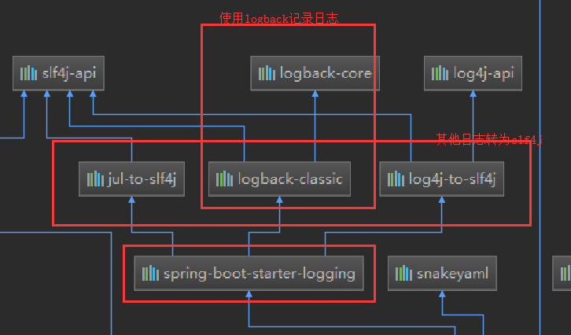

# 日志
[TOC]

## 1.日志框架

spring boot 底层是spring框架，spring 框架默认使用JCL;springboot 默认使用slf4j作为日志抽象层，logback做为日志实现。

## 2. Slf4j的使用

### 2.1 如何在系统中使用slf4j
以后在开发的时候，日志记录方法的使用，不应该直接调用日志的实现，而是调用日志抽象层里面的方法。  

给系统导入slf4j和logback的依赖
```java
import org.slf4j.Logger;
import org.slf4j.LoggerFactory;

public class HelloWorld {
  public static void main(String[] args) {
    Logger logger = LoggerFactory.getLogger(HelloWorld.class);
    logger.info("Hello World");
  }
}
```
图示：


每一个日志的实现框架都有自己的配置文件，使用slf4j之后，**配置文件还是做成日志实现框架的配置文件。**

### 2.2 遗留问题


如何让系统中所有的日志都统一到slf4j:  

1. 将系统中日他日志框架先排除
2. 用中间包替换原有的日志框架
3. 导入slf4j的其他实现

## 3. Spring Boot 日志关系
```xml
<dependency>
    <groupId>org.springframework.boot</groupId>
            <artifactId>spring-boot-starter</artifactId>
</dependency>
```

spring boot 使用它做日志功能
```xml
<dependency>
      <groupId>org.springframework.boot</groupId>
      <artifactId>spring-boot-starter-logging</artifactId>
      <version>2.1.0.RELEASE</version>
      <scope>compile</scope>
</dependency>
```

spring boot 日志底层依赖关系
c

总结：  
1. springboot底层使用slf4j+logback的方式实现日志记录
2. 也考虑到其他的日志实现框架，把其他的日志换成slf4j
3. 如果我们引入其他的日志框架，需要把这个框架的默认日志依赖移除掉
 

 ## 4 日志使用
 ### 4.1 默认配置
 ```java
 Logger logger = LoggerFactory.getLogger(getClass());

    @Test
    public void contextLoads() {

        //日志的级别
        //由低到高 trace<debug<info<warn<error
        //可以调节输出的日志级别，日志只会在这个级别以后的高级别生效
        logger.trace("这是trace 日志");
        logger.debug("这是debug日志");
        //spring boot 默认info级别，没有指定级别就用的是spirngboot默认规定的级别，root级别
        logger.info("这是info日志");
        logger.warn("这是warn日志");
        logger.error("这是error日志");
    }
```

```properties

# 指定目录文件的路径
# 注意 logging.path 和 logging file 是互斥的，只能指定一个，如果同时指定，logging.file生效
logging.path=F:/springboot/log

# 不指定的的时候，就在当前项目目录下生成spring.log日志文件
# 可以指定完整的路径
logging.file=springboot.log
```

```properties
#指定控制台输出的格式
#ogging.pattern.console=
#指定文件中输出的格式
#logging.pattern.file=
```

### 4.2 指定配置
给classpath下面放上日志框架自己的配置文件即可，这样springboot就不会使用默认配置  

| Logging System | Customization |
| - | - |
| logback | logback-spring.xml,logback.xml |
| log4j2 | log4j2-sping.xml,log4j2.xml |
| JDK(Java Util Logging) | logging.properties |


logback.xml 直接就被日志框架加载了；
logback-spring.xml 日志框架就不直接加载日志的配置项，由springboot，可以使用springboot 的高级profiles功能。
### 4.3 切换日志框架
将 之前的 spring-boot-starter-logging 换成log4j2的starter
