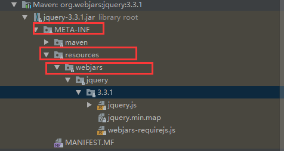
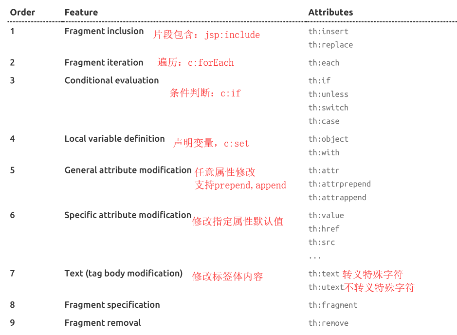

[TOC]

# Spring Boot 开发web 应用

## 1. spring boot对静态资源的映射规则
```java
@ConfigurationProperties(
    prefix = "spring.resources",
    ignoreUnknownFields = false
)
public class ResourceProperties {

}

可以利用spring.resources 设置和静态资源有关的参数，比如缓存时间等

```

** spring.resources.static-locations=配置静态资源文件夹**

1) /webjars/**
```java
 public void addResourceHandlers(ResourceHandlerRegistry registry) {
            if (!this.resourceProperties.isAddMappings()) {
                logger.debug("Default resource handling disabled");
            } else {
                Duration cachePeriod = this.resourceProperties.getCache().getPeriod();
                CacheControl cacheControl = this.resourceProperties.getCache().getCachecontrol().toHttpCacheControl();
                if (!registry.hasMappingForPattern("/webjars/**")) {
                    this.customizeResourceHandlerRegistration(registry.addResourceHandler(new String[]{"/webjars/**"}).addResourceLocations(new String[]{"classpath:/META-INF/resources/webjars/"}).setCachePeriod(this.getSeconds(cachePeriod)).setCacheControl(cacheControl));
                }

                String staticPathPattern = this.mvcProperties.getStaticPathPattern();
                if (!registry.hasMappingForPattern(staticPathPattern)) {
                    this.customizeResourceHandlerRegistration(registry.addResourceHandler(new String[]{staticPathPattern}).addResourceLocations(getResourceLocations(this.resourceProperties.getStaticLocations())).setCachePeriod(this.getSeconds(cachePeriod)).setCacheControl(cacheControl));
                }

            }
        }
```

所有 `/webjars/**`都去`classpath:/META-INF/resources/webjars/`找资源。  

warjars:以jar的形式引入静态资源，去 https://www.webjars.org/   
  

访问`localhost:8080/webjars/jquery/3.3.1/jquery.js`

```xml
<dependency>
    <groupId>org.webjars</groupId>
    <artifactId>jquery</artifactId>
    <version>3.3.1</version>
</dependency>
```

2) /** 访问当前项目的任何资源（静态资源的文件夹）

```java
 String staticPathPattern = this.mvcProperties.getStaticPathPattern();
                if (!registry.hasMappingForPattern(staticPathPattern)) {
                    this.customizeResourceHandlerRegistration(registry.addResourceHandler(new String[]{staticPathPattern}).addResourceLocations(getResourceLocations(this.resourceProperties.getStaticLocations())).setCachePeriod(this.getSeconds(cachePeriod)).setCacheControl(cacheControl));
                }
```

"classpath:/META-INF/resources/", "classpath:/resources/", "classpath:/static/", "classpath:/public/

> 1. classpath:/META-INF/resources/
> 2. classpath:/resources/
> 3. classpath:/static/
> 4. classpath:/public/
> 5. /(当前项目根路径)

访问：lochost:8080/abc ==>静态资源文件夹里面找abc  

3) 欢迎页的映射：静态资源文件夹下的index.html页面，被`/**`映射  
访问localhost：8080
```java
 @Bean
        public WelcomePageHandlerMapping welcomePageHandlerMapping(ApplicationContext applicationContext) {
            return new WelcomePageHandlerMapping(new TemplateAvailabilityProviders(applicationContext), applicationContext, this.getWelcomePage(), this.mvcProperties.getStaticPathPattern());
        }
```


4) 配置喜欢的图标

```java
 @Configuration
        @ConditionalOnProperty(
            value = {"spring.mvc.favicon.enabled"},
            matchIfMissing = true
        )
        public static class FaviconConfiguration implements ResourceLoaderAware {
            private final ResourceProperties resourceProperties;
            private ResourceLoader resourceLoader;

            public FaviconConfiguration(ResourceProperties resourceProperties) {
                this.resourceProperties = resourceProperties;
            }

            public void setResourceLoader(ResourceLoader resourceLoader) {
                this.resourceLoader = resourceLoader;
            }

            @Bean
            public SimpleUrlHandlerMapping faviconHandlerMapping() {
                SimpleUrlHandlerMapping mapping = new SimpleUrlHandlerMapping();
                mapping.setOrder(-2147483647);
                mapping.setUrlMap(Collections.singletonMap("**/favicon.ico", this.faviconRequestHandler()));
                return mapping;
            }

            @Bean
            public ResourceHttpRequestHandler faviconRequestHandler() {
                ResourceHttpRequestHandler requestHandler = new ResourceHttpRequestHandler();
                requestHandler.setLocations(this.resolveFaviconLocations());
                return requestHandler;
            }

            private List<Resource> resolveFaviconLocations() {
                String[] staticLocations = WebMvcAutoConfiguration.WebMvcAutoConfigurationAdapter.getResourceLocations(this.resourceProperties.getStaticLocations());
                List<Resource> locations = new ArrayList(staticLocations.length + 1);
                Stream var10000 = Arrays.stream(staticLocations);
                ResourceLoader var10001 = this.resourceLoader;
                this.resourceLoader.getClass();
                var10000.map(var10001::getResource).forEach(locations::add);
                locations.add(new ClassPathResource("/"));
                return Collections.unmodifiableList(locations);
            }
        }

```

所有的**/favicon.ico 都是在静态资源文件夹下面找


## 2. Thymeleaf

###  2.1 引入thymeleaf

```xml
 <dependency>
            <groupId>org.springframework.boot</groupId>
            <artifactId>spring-boot-starter-thymeleaf</artifactId>
</dependency>
```

### 2.2 Thymeleaf 使用&语法
```java
@ConfigurationProperties(
    prefix = "spring.thymeleaf"
)
public class ThymeleafProperties {
    private static final Charset DEFAULT_ENCODING;
    public static final String DEFAULT_PREFIX = "classpath:/templates/";
    public static final String DEFAULT_SUFFIX = ".html";
    private boolean checkTemplate = true;
    private boolean checkTemplateLocation = true;
    //只要把html放在 templates文件夹下面，thymeleaf自动渲染
    private String prefix = "classpath:/templates/";

    private String suffix = ".html";
    private String mode = "HTML";
```
只要把html放在 templates文件夹下面，thymeleaf自动渲染. 

**使用**  

1. 导入thymeleaf的命名空间
```xml
xmlns:th="http://www.thymeleaf.org"
```
2. 语法规则
    1. th:test;改变当前元素里面的文本内容  
        th:任意html属性，替换原来属性的值  
        
3. 表达式语法
```properties
Simple expressions:
    Variable Expressions: ${...}
        1)获取对象的属性，调用方法
        2）获取内置的基本对象
            #ctx : the context object.
            #vars: the context variables.
            #locale : the context locale.
            #request : (only in Web Contexts) the HttpServletRequest object.
            #response : (only in Web Contexts) the HttpServletResponse object.
            #session : (only in Web Contexts) the HttpSession object.
            #servletContext : (only in Web Contexts) the ServletContext object.
        3）内置的一些工具对象
            #execInfo : information about the template being processed.
            #messages : methods for obtaining externalized messages inside variables expressions, in the same way as they
            would be obtained using #{…} syntax.
            #uris : methods for escaping parts of URLs/URIs
            Page 20 of 106
            #conversions : methods for executing the configured conversion service (if any).
            #dates : methods for java.util.Date objects: formatting, component extraction, etc.
            #calendars : analogous to #dates , but for java.util.Calendar objects.
            #numbers : methods for formatting numeric objects.
            #strings : methods for String objects: contains, startsWith, prepending/appending, etc.
            #objects : methods for objects in general.
            #bools : methods for boolean evaluation.
            #arrays : methods for arrays.
            #lists : methods for lists.
            #sets : methods for sets.
            #maps : methods for maps.
            #aggregates : methods for creating aggregates on arrays or collections.
            #ids : methods for dealing with id attributes that might be repeated (for example, as a result of an iteration).

    Selection Variable Expressions: *{...} 选择表达式，和${}功能上一样
        补充：配合th:object使用
        <div th:object="${session.user}">
            <p>Name: <span th:text="*{firstName}">Sebastian</span>.</p>
            <p>Surname: <span th:text="*{lastName}">Pepper</span>.</p>
            <p>Nationality: <span th:text="*{nationality}">Saturn</span>.</p>
        </div>

    Message Expressions: #{...} 获取国际化内容

    Link URL Expressions: @{...} 定义url链接
        @{/order/process(execId=${execId},execType='FAST')}

    Fragment Expressions: ~{...} 片段引用表达式

    Literals （字面量）
        Text literals: 'one text' , 'Another one!' ,…
        Number literals: 0 , 34 , 3.0 , 12.3 ,…
        Boolean literals: true , false
        Null literal: null
        Literal tokens: one , sometext , main ,…
    Text operations:（文本操作）
        String concatenation: +
        Literal substitutions: |The name is ${name}|
    Arithmetic operations: （数学运算）
        Binary operators: + , - , * , / , %
        Minus sign (unary operator): -
    Boolean operations:（布尔运算）
        Binary operators: and , or
        Boolean negation (unary operator): ! , not
    Comparisons and equality:（比较运算）
        Comparators: > , < , >= , <= ( gt , lt , ge , le )
        Equality operators: == , != ( eq , ne )
    Conditional operators:（条件运算）
        If-then: (if) ? (then)
        If-then-else: (if) ? (then) : (else)
        Default: (value) ?: (defaultvalue)

    Special tokens:
        No-Operation: _
```

## 3. Spring MVC 自动配置
**Spring Boot自动配置了Spring MVC**  
以下是Spring Boot 对Spring MVC的自动配置  

• Inclusion of ContentNegotiatingViewResolver and BeanNameViewResolver beans. 

    * 自动配置了ViewResovler(视图解析器，根据方法的返回值得到视图对象（View）,视图对象决定如何渲染（转发？重定向）)   
    * ContentNegotiatingViewResolver:组合所有的视图解析器；  
    * 如何定制：我们只需要在容器中添加一个视图解析器，自动的将其组合进来。


    
• Support for serving static resources, including support for WebJars (covered later in this document)). 静态资源文件夹，webjars
• Static index.html support. 静态资源首页
• Custom Favicon support (covered later in this document). favicon.ico


• Automatic registration of Converter, GenericConverter, and Formatter beans.
    
    * Converter :转换器; public String hello(User user);类型转换使用Converter  
    * Formatter: 格式化器； 2017.12.17==》Date

```java
       public void addFormatters(FormatterRegistry registry) {
            Iterator var2 = this.getBeansOfType(Converter.class).iterator();

            while(var2.hasNext()) {
                Converter<?, ?> converter = (Converter)var2.next();
                registry.addConverter(converter);
            }

            var2 = this.getBeansOfType(GenericConverter.class).iterator();

            while(var2.hasNext()) {
                GenericConverter converter = (GenericConverter)var2.next();
                registry.addConverter(converter);
            }

            var2 = this.getBeansOfType(Formatter.class).iterator();

            while(var2.hasNext()) {
                Formatter<?> formatter = (Formatter)var2.next();
                registry.addFormatter(formatter);
            }

        }
```
    可以自己添加Converter和Formatter，只要放在容器中即可。


• Support for HttpMessageConverters (covered later in this document).、

    * HttpMessageConverters ：SpringMVC 中用来转换http请求和响应的；User->jsjon

• Automatic registration of MessageCodesResolver (covered later in this document). 定错误代码生成规则


• Automatic use of a ConfigurableWebBindingInitializer bean (covered later in this document).
If you want to keep Spring Boot MVC features and you want to add additional MVC configuration
(interceptors, formatters, view controllers, and other features), you can add your own @Configuration
class of type WebMvcConfigurer but without @EnableWebMvc. If you wish to provide
custom instances of RequestMappingHandlerMapping, RequestMappingHandlerAdapter, or
ExceptionHandlerExceptionResolver, you can declare a WebMvcRegistrationsAdapter
instance to provide such components.
If you want to take complete control of Spring MVC, you can add your own @Configuration annotated with @EnableWebMvc.

### 4.修改

模式

    1. Spring Boot 在自动配置很多组件的时候，先看容器中有没有用户自己配置的（@Bean、@Component），如果有就用用户配置的。如果没有才自动配置。 如果有些组件可以有多个(ViewResolver),将胡用户配置的和自己默认的组合起来。